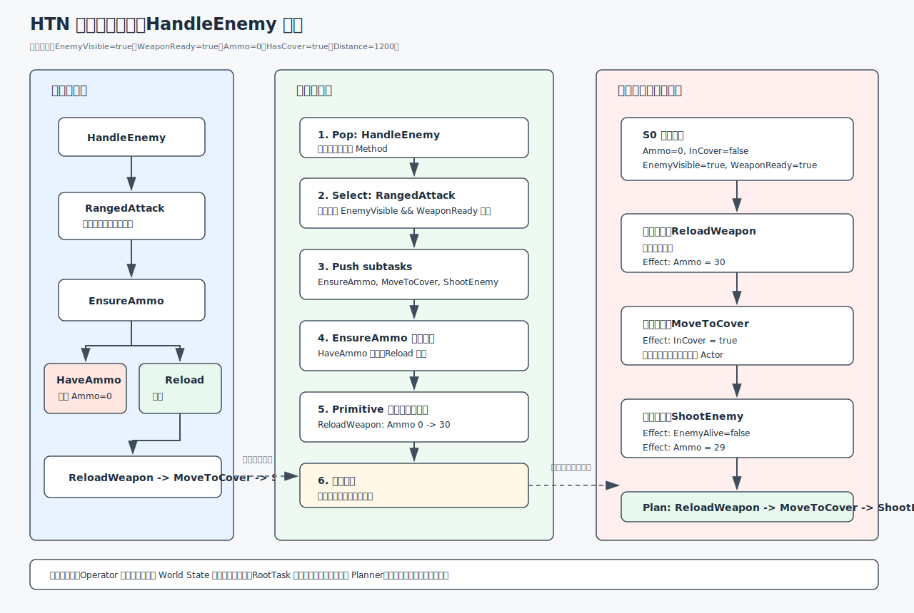
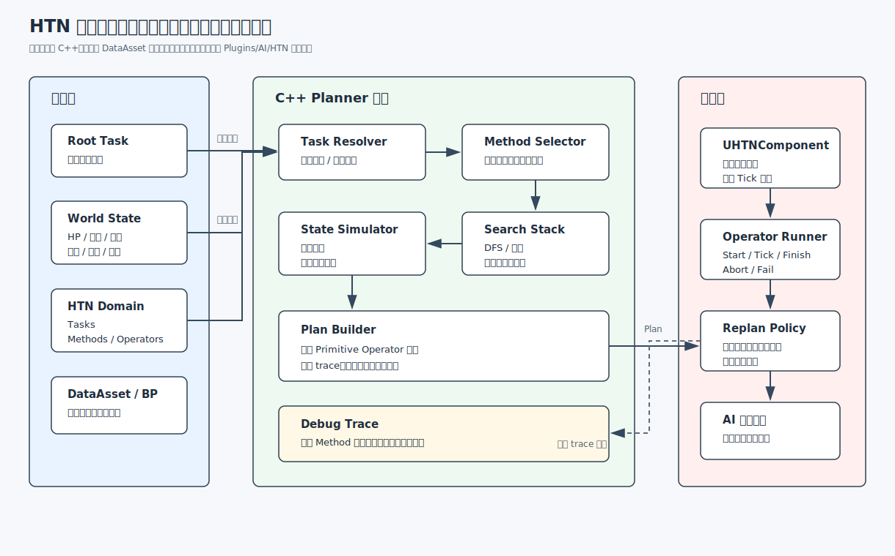

# HTN 算法原理、代码框架、计算过程与 UE 插件实现方案 

本文记录 HTN（Hierarchical Task Network，分层任务网络）学习与实现设计。范围限定在 `Plugins/AI/HTN` 插件内，当前不修改功能代码。

## 1. HTN 是什么

HTN 是一类 Hierarchical Planning（分层规划）算法 / 形式化方法。它通常和 Classical Planning（STRIPS / PDDL）并列讨论，而不是从属于 Classical Planning。GOAP 更接近 Classical Planning 在游戏 AI 里的工程化应用；HTN 的表达力和可判定性与 Classical Planning 不同，一般形式下 HTN 规划不可判定，而 Classical Planning 通常讨论 PSPACE-complete。HTN 强调“任务分解”，不是“目标状态搜索”。它不直接问“如何从当前状态搜索到目标状态”，而是把一个高层任务逐层拆成更小任务，直到得到可执行的原子动作序列。

核心思想：

- 智能体有一个高层任务，例如 `赢得战斗`、`完成巡逻`、`收集资源并建造建筑`。
- 高层任务是复合任务，不能直接执行。
- 复合任务通过 Method（方法）拆解成子任务列表。
- 子任务继续拆解，直到变成 Primitive Task（原子任务）。
- 原子任务绑定 Operator（操作器），有前置条件、执行逻辑、效果。
- Planner 用当前世界状态搜索出一条合法 Plan。
- Executor 按 Plan 执行动作；世界变化后可局部重规划或全量重规划。

HTN 类似行为树，但它更偏“先生成计划，再执行计划”。行为树更偏“每 tick 从树根重新决策”。HTN 适合多步骤、有依赖、有资源状态、有中长期目标的 AI。

## 2. 核心概念

| 概念 | 说明 | UE 插件建议类型 |
| --- | --- | --- |
| World State | AI 认知中的世界状态，如 HP、目标距离、弹药、是否有掩体 | `FHTNWorldState` |
| Task | 任务基类，分复合任务和原子任务 | `UHTNTask` |
| Compound Task | 复合任务，只能被 Method 拆解 | `UHTNCompoundTask` |
| Primitive Task | 原子任务，可绑定 Operator 执行 | `UHTNPrimitiveTask` |
| Method | 拆解规则，包含前置条件和子任务列表 | `UHTNMethod` |
| Operator | 原子动作执行器，包含执行逻辑和效果 | `UHTNOperator` |
| Preconditions | 前置条件，判断 Method 或 Operator 是否可用 | `FHTNCondition` |
| Effects | 计划模拟效果，更新临时世界状态 | `FHTNEffect` |
| Plan | 原子动作序列，Planner 输出 | `FHTNPlan` |
| Planner | 递归拆解和搜索模块 | `FHTNPlanner` |
| Executor | 按计划执行动作，处理失败和重规划 | `UHTNComponent` |

### 2.1 Method 语义边界

Method 是“分解策略是否适用”的判断，不是“子任务一定能成功”的保证。

正确边界：

- Method Preconditions：判断当前是否应该采用这种分解方式。例如 `RangedAttack` 要求 `EnemyVisible && WeaponReady`。
- SubTask Preconditions：判断每个子任务自己能否执行。例如 `ReloadWeapon` 自己判断是否能换弹。
- Operator Preconditions：判断原子动作在计划期和执行期是否可用。

反模式：把所有子任务条件都堆到 Method 上。结果是 Method 过重、复用差、回溯信息不清楚，后续改一个子任务会影响整条分解链。

### 2.2 Compound Task 子类型

第一版建议把 `Compound Task` 明确定义为 Selector：按 Method 固定顺序尝试，选第一个可完成计划的 Method。这与当前伪代码一致，最容易调试。

可预留二期扩展：

- Selector：按顺序选择第一个可用 Method。当前默认。
- Sequence：没有备选分支，只有一个隐式 Method；子任务必须按顺序全部成功。它不是“多个 Method 依次展开”。
- Random Selector：按权重随机选择 Method，适合非关键行为多样化。

Fluid HTN 常见做法是把 Compound Task 明确拆成不同类型，避免 Selector 的“分支选择”和 Sequence 的“顺序必成”语义混在一个类里。

## 3. HTN 与行为树差异

| 维度 | HTN | 行为树 |
| --- | --- | --- |
| 决策方式 | 先搜索计划，再执行 | 每 tick 从根节点运行 |
| 表达重点 | 任务分解、前置条件、状态效果 | 控制流、条件、动作 |
| 中长期行为 | 强，天然支持多步计划 | 需要手写状态机或复杂树结构 |
| 动态响应 | 依赖重规划策略 | Tick 级响应更直接 |
| 调试对象 | 当前计划、拆解路径、状态变化 | 当前运行节点路径 |
| 适合场景 | 战术 AI、生产链、任务链、资源调度 | 即时反应、动作组合、简单状态逻辑 |

HTN 和行为树可以共存：行为树负责顶层感知和模式切换，HTN 负责某个模式内的复杂计划生成。例子：BT 顶层只做 `巡逻 / 战斗 / 逃跑` 状态切换；进入 `战斗` 后，HTN 规划具体战术，例如 `找掩体 -> 换弹 -> 压制射击 -> 侧移`。

## 3.1 HTN 与 GOAP 差异

游戏 AI 圈里，HTN 最重要的对照对象不是行为树，而是 GOAP（如《F.E.A.R.》和《巫师 3》部分系统）。两者都会生成计划，但输入模型和搜索方向不同。

| 维度 | HTN | GOAP |
| --- | --- | --- |
| 输入 | 根任务 + 分解方法 | 目标状态 |
| 搜索方向 | 自顶向下分解任务 | 自底向上拼接 Action，常用 A* |
| 设计成本 | 需要写 Method，领域知识强 | 需要写 Action 前置条件和效果 |
| 行为形态 | 受 Method 控制，更像人写的剧本 | 算法自由组合，可能出现意外解 |
| 可预测性 | 高，调试路径接近设计意图 | 中，取决于代价函数和启发式 |
| 扩展成本 | 新策略通常加 Method | 新能力通常加 Action |
| 典型适用 | 战术套路、任务链、强导演行为 | 开放目标、多路径工具组合 |

简单判断：

- 行为要像设计师写好的战术剧本，优先 HTN。
- 行为只关心达成目标，允许系统自由拼 Action，优先 GOAP。
- UE 插件第一版做 HTN，比做 GOAP 更适合战斗 AI、任务链和可解释调试。

## 4. 算法原理：HTN 到底怎么“算”

HTN Planner 计算的不是“某个节点返回成功/失败”，而是在一个搜索空间里找出一条能把根任务完全拆成原子动作的路径。这个搜索空间的节点可以理解为四元组：

```text
PlanningNode = <SimWorldState, TaskStack, PlanSoFar, Trace>
```

含义：

- `SimWorldState`：规划期模拟世界状态。它是真实世界状态的值类型快照，Planner 只改这份副本。
- `TaskStack`：待处理任务栈 / 前向链表。总序 HTN 中，Planner 总是取栈顶任务计算；Method 的子任务插回当前位置之前，等价于压栈。
- `PlanSoFar`：已经确认的原子动作序列。
- `Trace`：调试路径，记录每次选择 Method、条件失败、回溯原因。

总序 HTN（Total-Order HTN）：子任务必须按声明顺序执行，规划器每次处理栈顶任务。偏序 HTN（Partial-Order HTN / POCL）：子任务之间只声明依赖关系，调度时可重排或并行，实现复杂度显著上升。SHOP / SHOP2 是经典总序 HTN 实现，PyHOP 是 Python 简化版。第一版建议只做总序 HTN。

### 4.1 输入是什么

HTN 规划输入不是一个“目标状态”，而是一套“从根任务开始如何拆解”的领域知识。

| 输入 | 作用 | 示例 |
| --- | --- | --- |
| `InitialWorldState` | 规划开始时的世界快照 | `Ammo=0`, `EnemyVisible=true` |
| `RootTask` | 要完成的高层任务 | `HandleEnemy` |
| `TaskTable` | 任务定义表，区分复合任务和原子任务 | `HandleEnemy`, `ReloadWeapon` |
| `MethodTable` | 复合任务的拆解方法 | `RangedAttack`, `MeleeAttack` |
| `OperatorTable` | 原子任务绑定的执行动作 | `OpReloadWeapon` |
| `PlanningConfig` | 搜索限制 | 最大深度、最大节点数、最大耗时 |

### 4.2 中间计算状态是什么

Planner 每次展开一个任务，都会产生新的中间状态。关键是“分支隔离”：每个 Method 分支必须拿自己的 `BranchState` 和 `BranchPlan`，不能污染其他分支。

| 中间变量 | 说明 |
| --- | --- |
| `CurrentTask` | 当前从 `TaskStack` 栈顶取出的任务 |
| `RemainingTasks` | 弹出 `CurrentTask` 后剩下的任务栈内容 |
| `CandidateMethod` | 当前尝试的 Method |
| `ExpandedTasks` | `CandidateMethod.SubTasks + RemainingTasks` |
| `BranchState` | 当前分支专用世界状态副本 |
| `BranchPlan` | 当前分支专用计划副本 |
| `FailureReason` | 条件失败、无 Method、深度超限等失败原因 |

### 4.3 每一步怎么计算

1. 初始化规划节点：

```text
SimWorldState = Clone(InitialWorldState)
TaskStack = [RootTask]
PlanSoFar = []
Trace = []
```

2. 如果 `TaskStack` 为空，说明所有任务都被处理完，规划成功。输出 `PlanSoFar`。

3. 从栈顶取出 `CurrentTask`，同时保存 `RemainingTasks`。注意：`RemainingTasks` 是所有分支共享的“当前任务之后的任务”，后面不能被某个分支污染。

4. 如果 `CurrentTask` 是复合任务：

- 按 Method 顺序尝试。第一版默认 Method 数组顺序就是固定优先级。
- 对每个 Method 先检查 Method Preconditions。
- Method Preconditions 只判断“这种拆解策略现在是否适用”，不保证子任务一定成功。
- 条件失败则记录 trace，尝试下一个 Method。
- 条件成功则生成：`ExpandedTasks = Method.SubTasks + RemainingTasks`。
- 用 `BranchState`、`BranchPlan` 递归计算 `ExpandedTasks`。
- 如果分支成功，把分支结果作为最终结果返回。
- 如果分支失败，丢弃这个分支的 `BranchState` 和 `BranchPlan`，回到下一个 Method。

5. 如果 `CurrentTask` 是原子任务：

- 找到绑定的 Operator。
- 检查 Operator Preconditions。
- 条件失败则当前分支失败，返回给上一层回溯。
- 条件成功则把 Operator 追加到 `PlanSoFar`。
- 把 Operator Effects 应用到 `SimWorldState`，只改模拟状态，不改真实 Actor。
- 继续计算 `RemainingTasks`。

6. 如果所有 Method 都失败，或原子任务条件失败，当前分支失败。上一层负责尝试其他 Method。

7. 如果所有分支都失败，规划失败。输出失败原因和 trace，不输出可执行 Plan。

### 4.4 输出内容是什么

成功时输出 `FHTNPlan`。它不只是动作数组，还应该带足够调试信息。

| 输出字段 | 说明 |
| --- | --- |
| `bSuccess` | 是否规划成功 |
| `RootTask` | 本次规划的根任务 |
| `Steps` | 原子动作序列，每个元素对应一个 Operator |
| `PredictedFinalState` | 应用所有 Plan Effects 后的预测状态 |
| `WatchedKeys` | 计划依赖的关键状态键，用于过期和重规划 |
| `Trace` | Method 选择、条件检查、回溯路径 |
| `FailureReason` | 失败时的主原因 |
| `ExpandedNodeCount` | 展开节点数，用于性能分析 |
| `PlanId / Version` | 可选，长时计划持久化和恢复时使用 |

失败时输出 `FHTNPlanFailure` 或 `FHTNPlan` 的失败态：

```text
bSuccess = false
Steps = []
FailureReason = NoMethodSatisfied / OperatorPreconditionFailed / DepthLimit / NodeLimit / TimeLimit
Trace = 完整失败路径
```

### 4.5 为什么 Effects 必须在规划期计算

HTN 不是只检查当前状态。它要预测“如果前一个动作成功，后一个动作是否能做”。

例子：

```text
当前 Ammo = 0
计划 ReloadWeapon，Effect: Ammo = 30
然后计划 ShootEnemy，Precondition: Ammo > 0
```

如果不在规划期应用 `ReloadWeapon` 的 Effect，`ShootEnemy` 会因为 `Ammo == 0` 被错误判定失败。所以 Planner 必须维护 `SimWorldState`，逐步应用原子动作的预测效果。

### 4.6 回溯到底回到哪里

回溯只发生在“复合任务选择 Method”的地方。原子任务失败时，它自己没有别的选择，只能把失败交给上层复合任务。

```text
HandleEnemy
  Method A: RangedAttack
    EnsureAmmo -> MoveToCover -> ShootEnemy
  Method B: MeleeAttack
    MoveToEnemy -> MeleeHit
```

如果 `RangedAttack` 展开后，`ShootEnemy` 条件失败，Planner 会回到 `HandleEnemy`，尝试 `MeleeAttack`。如果 `MeleeAttack` 也失败，`HandleEnemy` 整体失败。

## 5. 计算过程

完整计算流程可以按“任务栈变化 + 模拟状态变化 + 计划数组变化”理解。

### 5.1 成功分支计算流程

```text
输入：RootTask = HandleEnemy
初始：TaskStack = [HandleEnemy]
初始：PlanSoFar = []
初始：SimWorldState = S0
```

每轮计算：

1. 取栈顶任务。
2. 如果是复合任务，用 Method 替换它。
3. 如果是原子任务，用 Operator 消耗它，并把 Operator 加进计划。
4. Operator 成功进入计划后，立刻把 Effects 写入模拟状态。
5. 循环直到任务栈为空。

任务栈变化类似这样：

```text
[HandleEnemy]
[RangedAttack 展开] -> [EnsureAmmo, MoveToCover, ShootEnemy]
[EnsureAmmo 展开]  -> [ReloadWeapon, MoveToCover, ShootEnemy]
[ReloadWeapon 执行规划] -> [MoveToCover, ShootEnemy]
[MoveToCover 执行规划] -> [ShootEnemy]
[ShootEnemy 执行规划]  -> []
```

计划数组变化：

```text
[]
[ReloadWeapon]
[ReloadWeapon, MoveToCover]
[ReloadWeapon, MoveToCover, ShootEnemy]
```

模拟状态变化：

```text
S0: Ammo=0, InCover=false, EnemyAlive=true
S1 after ReloadWeapon: Ammo=30
S2 after MoveToCover: Ammo=30, InCover=true
S3 after ShootEnemy: Ammo=29, InCover=true, EnemyAlive=false
```

### 5.2 失败分支计算流程

失败不一定代表整体规划失败。失败只代表“当前分支不通”。

常见失败点：

- Method Preconditions 失败：这个 Method 不适用，尝试下一个 Method。
- Operator Preconditions 失败：当前原子动作不能计划，当前分支失败。
- 子任务无可用 Method：当前分支失败。
- 超过深度 / 节点 / 时间限制：整个规划失败或当前分支失败，取决于策略。

回溯时丢弃： 

- 当前分支的 `BranchState`
- 当前分支的 `BranchPlan`
- 当前分支追加的 trace 节点

回溯时保留：

- 进入分支前的 `State`
- 进入分支前的 `PlanSoFar`
- `RemainingTasks`
- 父级复合任务的其他 Method

### 5.3 计算成本

HTN 的成本主要来自 Method 分支数量和任务深度。

粗略估算：

```text
最坏展开节点数 ≈ 每层 Method 数量 ^ 复合任务深度
```

但游戏 HTN 通常比 GOAP 更可控，因为 Method 人为限制了搜索路径。代价是领域知识要写得更明确。

第一版必须加限制：

- `MaxDepth`：最大递归深度。
- `MaxExpandedNodes`：最大展开节点数。
- `MaxPlanningTimeMs`：最大规划耗时。
- `MaxPlanSteps`：最大原子动作数。

## 6. 计算过程示例

示例目标：`处理敌人`

这版示例不把一次 `ShootEnemy` 直接写成击杀，而是让射击消耗 3 发弹药、造成 50 伤害；`AttackUntilDead` 会根据 `EnemyHP` 决定是否继续射击。这样能展示 HTN 如何用计划期 Effects 推动多步规划。

初始世界状态：

```text
HasEnemy = true
EnemyVisible = true
Ammo = 0
HasCover = true
DistanceToEnemy = 1200
WeaponReady = true
InCover = false
EnemyHP = 100
```

根任务：

```text
HandleEnemy
```

任务库：

```text
HandleEnemy               // 复合任务，Selector
  Method A: RangedAttack
    条件: EnemyVisible && WeaponReady
    子任务: EnsureAmmo -> MoveToCover -> AttackUntilDead

  Method B: MeleeAttack
    条件: EnemyVisible && DistanceToEnemy < 200
    子任务: MoveToEnemy -> MeleeHit

EnsureAmmo                // 复合任务，Selector
  Method A: AlreadyHaveAmmo
    条件: Ammo >= 3
    子任务: None

  Method B: Reload
    条件: Ammo < 3
    子任务: ReloadWeapon

AttackUntilDead           // 复合任务，Selector
  Method A: EnemyAlreadyDead
    条件: EnemyHP <= 0
    子任务: None

  Method B: KeepShooting
    条件: EnemyHP > 0
    子任务: EnsureAmmo -> ShootEnemy -> AttackUntilDead

ReloadWeapon              // 原子任务，Operator = OpReloadWeapon
  条件: CanReload == true
  效果: Ammo = 30

MoveToCover               // 原子任务，Operator = OpMoveToCover
  条件: HasCover == true
  效果: InCover = true

ShootEnemy                // 原子任务，Operator = OpShootEnemy
  条件: EnemyVisible == true && Ammo >= 3 && EnemyHP > 0
  效果: Ammo -= 3, EnemyHP -= 50
```

逐步计算表：

| 步骤 | 当前任务 | 任务栈变化 | 条件判断 | 模拟状态变化 | Plan |
| --- | --- | --- | --- | --- | --- |
| 0 | 初始化 | `[HandleEnemy]` | - | `Ammo=0, EnemyHP=100, InCover=false` | `[]` |
| 1 | `HandleEnemy` | 展开 `RangedAttack` -> `[EnsureAmmo, MoveToCover, AttackUntilDead]` | `EnemyVisible && WeaponReady` 通过 | 无 | `[]` |
| 2 | `EnsureAmmo` | 先试 `AlreadyHaveAmmo` | `Ammo >= 3` 失败 | 无，回溯到 `EnsureAmmo` | `[]` |
| 3 | `EnsureAmmo` | 试 `Reload` -> `[ReloadWeapon, MoveToCover, AttackUntilDead]` | `Ammo < 3` 通过 | 无 | `[]` |
| 4 | `ReloadWeapon` | 消耗原子任务 -> `[MoveToCover, AttackUntilDead]` | `CanReload == true` 通过 | `Ammo: 0 -> 30` | `[ReloadWeapon]` |
| 5 | `MoveToCover` | 消耗原子任务 -> `[AttackUntilDead]` | `HasCover == true` 通过 | `InCover: false -> true` | `[ReloadWeapon, MoveToCover]` |
| 6 | `AttackUntilDead` | 先试 `EnemyAlreadyDead` | `EnemyHP <= 0` 失败 | 无，回溯到 `AttackUntilDead` | `[ReloadWeapon, MoveToCover]` |
| 7 | `AttackUntilDead` | 试 `KeepShooting` -> `[EnsureAmmo, ShootEnemy, AttackUntilDead]` | `EnemyHP > 0` 通过 | 无 | `[ReloadWeapon, MoveToCover]` |
| 8 | `EnsureAmmo` | `AlreadyHaveAmmo` -> `None` | `Ammo >= 3` 通过 | 无 | `[ReloadWeapon, MoveToCover]` |
| 9 | `ShootEnemy` | 消耗原子任务 -> `[AttackUntilDead]` | `Ammo >= 3 && EnemyHP > 0` 通过 | `Ammo: 30 -> 27`, `EnemyHP: 100 -> 50` | `[ReloadWeapon, MoveToCover, ShootEnemy]` |
| 10 | `AttackUntilDead` | `KeepShooting` -> `[EnsureAmmo, ShootEnemy, AttackUntilDead]` | `EnemyHP > 0` 通过 | 无 | `[ReloadWeapon, MoveToCover, ShootEnemy]` |
| 11 | `EnsureAmmo` | `AlreadyHaveAmmo` -> `None` | `Ammo >= 3` 通过 | 无 | `[ReloadWeapon, MoveToCover, ShootEnemy]` |
| 12 | `ShootEnemy` | 消耗原子任务 -> `[AttackUntilDead]` | `Ammo >= 3 && EnemyHP > 0` 通过 | `Ammo: 27 -> 24`, `EnemyHP: 50 -> 0` | `[ReloadWeapon, MoveToCover, ShootEnemy, ShootEnemy]` |
| 13 | `AttackUntilDead` | `EnemyAlreadyDead` -> `None` | `EnemyHP <= 0` 通过 | 无 | `[ReloadWeapon, MoveToCover, ShootEnemy, ShootEnemy]` |
| 14 | 任务栈为空 | 成功 | - | 输出预测终态 | 输出 Plan |

输出计划：

```text
FHTNPlan
  bSuccess = true
  RootTask = HandleEnemy
  Steps = [
    OpReloadWeapon,
    OpMoveToCover,
    OpShootEnemy,
    OpShootEnemy
  ]
  PredictedFinalState = {
    Ammo = 24,
    InCover = true,
    EnemyHP = 0
  }
  WatchedKeys = [EnemyVisible, Ammo, TargetId, HasCover, EnemyHP]
  Trace = [
    Select HandleEnemy.RangedAttack,
    Reject EnsureAmmo.AlreadyHaveAmmo: Ammo >= 3 failed,
    Select EnsureAmmo.Reload,
    Accept OpReloadWeapon,
    Accept OpMoveToCover,
    Reject AttackUntilDead.EnemyAlreadyDead: EnemyHP <= 0 failed,
    Select AttackUntilDead.KeepShooting,
    Accept OpShootEnemy,
    Select AttackUntilDead.KeepShooting,
    Accept OpShootEnemy,
    Select AttackUntilDead.EnemyAlreadyDead
  ]
```

失败与回溯示例：

- 如果 `OpReloadWeapon` 条件失败，`EnsureAmmo.Reload` 分支失败。
- `EnsureAmmo` 没有更多 Method，`RangedAttack` 分支失败。
- Planner 回到 `HandleEnemy`，尝试 `MeleeAttack`。
- 如果 `DistanceToEnemy < 200` 失败，`MeleeAttack` 也失败。
- `HandleEnemy` 无可用分支，输出失败：`NoMethodSatisfied: HandleEnemy`。

### 6.1 规划计算过程图



## 7. 算法实现代码 / 伪代码

### 7.1 核心概念结构体实现草案

这里不是最终 UE 代码，只说明每个核心概念在 C++ 里应该保存什么数据。

```cpp
UENUM(BlueprintType)
enum class EHTNTaskType : uint8
{
    Compound,
    Primitive
};

UENUM(BlueprintType)
enum class EHTNValueType : uint8
{
    Bool,
    Int,
    Float,
    Name
};

USTRUCT(BlueprintType)
struct FHTNWorldValue
{
    GENERATED_BODY()

    UPROPERTY(EditAnywhere, BlueprintReadWrite)
    EHTNValueType Type = EHTNValueType::Bool;

    UPROPERTY(EditAnywhere, BlueprintReadWrite)
    bool BoolValue = false;

    UPROPERTY(EditAnywhere, BlueprintReadWrite)
    int32 IntValue = 0;

    UPROPERTY(EditAnywhere, BlueprintReadWrite)
    float FloatValue = 0.0f;

    UPROPERTY(EditAnywhere, BlueprintReadWrite)
    FName NameValue = NAME_None;
};

USTRUCT(BlueprintType)
struct FHTNWorldState
{
    GENERATED_BODY()

    UPROPERTY(EditAnywhere, BlueprintReadWrite)
    TMap<FName, FHTNWorldValue> Values;
};

USTRUCT(BlueprintType)
struct FHTNCondition
{
    GENERATED_BODY()

    UPROPERTY(EditAnywhere, BlueprintReadWrite)
    FName Key;

    UPROPERTY(EditAnywhere, BlueprintReadWrite)
    EHTNCompareOp Operator = EHTNCompareOp::Eq;

    UPROPERTY(EditAnywhere, BlueprintReadWrite)
    FHTNWorldValue ExpectedValue;
};

USTRUCT(BlueprintType)
struct FHTNEffect
{
    GENERATED_BODY()

    UPROPERTY(EditAnywhere, BlueprintReadWrite)
    FName Key;

    UPROPERTY(EditAnywhere, BlueprintReadWrite)
    EHTNEffectOp Operator = EHTNEffectOp::Set;

    UPROPERTY(EditAnywhere, BlueprintReadWrite)
    FHTNWorldValue Value;
};

USTRUCT(BlueprintType)
struct FHTNMethodDef
{
    GENERATED_BODY()

    UPROPERTY(EditAnywhere, BlueprintReadWrite)
    FName MethodId;

    UPROPERTY(EditAnywhere, BlueprintReadWrite)
    TArray<FHTNCondition> Preconditions;

    UPROPERTY(EditAnywhere, BlueprintReadWrite)
    TArray<FName> SubTasks;

    UPROPERTY(EditAnywhere, BlueprintReadWrite)
    int32 Priority = 0;
};

USTRUCT(BlueprintType)
struct FHTNTaskDef
{
    GENERATED_BODY()

    UPROPERTY(EditAnywhere, BlueprintReadWrite)
    FName TaskId;

    UPROPERTY(EditAnywhere, BlueprintReadWrite)
    EHTNTaskType TaskType = EHTNTaskType::Primitive;

    UPROPERTY(EditAnywhere, BlueprintReadWrite)
    TArray<FHTNMethodDef> Methods;

    UPROPERTY(EditAnywhere, BlueprintReadWrite)
    FName OperatorId;
};

USTRUCT(BlueprintType)
struct FHTNOperatorDef
{
    GENERATED_BODY()

    UPROPERTY(EditAnywhere, BlueprintReadWrite)
    FName OperatorId;

    UPROPERTY(EditAnywhere, BlueprintReadWrite)
    TArray<FHTNCondition> Preconditions;

    UPROPERTY(EditAnywhere, BlueprintReadWrite)
    TArray<FHTNEffect> Effects;
};

USTRUCT(BlueprintType)
struct FHTNPlanStep
{
    GENERATED_BODY()

    UPROPERTY(EditAnywhere, BlueprintReadWrite)
    FName TaskId;

    UPROPERTY(EditAnywhere, BlueprintReadWrite)
    FName OperatorId;
};

USTRUCT(BlueprintType)
struct FHTNPlanTraceEvent
{
    GENERATED_BODY()

    UPROPERTY(EditAnywhere, BlueprintReadWrite)
    FString Message;
};

USTRUCT(BlueprintType)
struct FHTNPlan
{
    GENERATED_BODY()

    UPROPERTY(EditAnywhere, BlueprintReadWrite)
    bool bSuccess = false;

    UPROPERTY(EditAnywhere, BlueprintReadWrite)
    FName RootTask;

    UPROPERTY(EditAnywhere, BlueprintReadWrite)
    TArray<FHTNPlanStep> Steps;

    UPROPERTY(EditAnywhere, BlueprintReadWrite)
    FHTNWorldState PredictedFinalState;

    UPROPERTY(EditAnywhere, BlueprintReadWrite)
    TArray<FName> WatchedKeys;

    UPROPERTY(EditAnywhere, BlueprintReadWrite)
    TArray<FHTNPlanTraceEvent> Trace;

    UPROPERTY(EditAnywhere, BlueprintReadWrite)
    FName FailureReason;
};
```

结构关系：

```text
Domain
  TaskTable: TaskId -> FHTNTaskDef
  OperatorTable: OperatorId -> FHTNOperatorDef

FHTNTaskDef
  Compound: Methods[]
  Primitive: OperatorId

FHTNMethodDef
  Preconditions[]
  SubTasks[]

FHTNOperatorDef
  Preconditions[]
  Effects[]

FHTNPlan
  Steps[] = Primitive Task + OperatorId
  PredictedFinalState = InitialWorldState + 所有 Effects
```

### 7.2 Planner 伪代码

`NodeBudget` 和 `Deadline` 必须是整个规划共享的全局预算，不能每次递归复制一份。否则每个分支都会“刷新预算”，限制失效。

```cpp
struct FHTNPlanRuntimeBudget
{
    int32 ExpandedNodeCount = 0;
    int32 MaxExpandedNodes = 512;
    double DeadlineSeconds = 0.0;

    bool ConsumeNode()
    {
        ++ExpandedNodeCount;
        return ExpandedNodeCount <= MaxExpandedNodes && FPlatformTime::Seconds() <= DeadlineSeconds;
    }
};

bool PlanTasks(
    const FHTNDomain& Domain,
    FHTNWorldState State,
    TArray<FName> TaskStack,
    FHTNPlan& Plan,
    FHTNPlanLimits Limits,
    FHTNPlanRuntimeBudget& Budget)
{
    if (!Budget.ConsumeNode())
    {
        Plan.FailureReason = "PlanningBudgetExceeded";
        return false;
    }

    if (TaskStack.IsEmpty())
    {
        Plan.bSuccess = true;
        Plan.PredictedFinalState = State;
        Plan.ExpandedNodeCount = Budget.ExpandedNodeCount;
        return true;
    }

    if (Limits.Depth > Limits.MaxDepth)
    {
        Plan.FailureReason = "DepthLimitExceeded";
        return false;
    }

    FName CurrentTaskId = TaskStack[0];
    TaskStack.RemoveAt(0);
    TArray<FName> RemainingTasks = TaskStack;

    const FHTNTaskDef* CurrentTask = Domain.FindTask(CurrentTaskId);
    if (!CurrentTask)
    {
        Plan.FailureReason = "TaskNotFound";
        return false;
    }

    if (CurrentTask->TaskType == EHTNTaskType::Primitive)
    {
        const FHTNOperatorDef* Operator = Domain.FindOperator(CurrentTask->OperatorId);
        if (!Operator || !CheckAll(Operator->Preconditions, State))
        {
            Plan.FailureReason = "OperatorPreconditionFailed";
            return false;
        }

        Plan.Steps.Add({CurrentTaskId, Operator->OperatorId});
        ApplyEffects(Operator->Effects, State);
        return PlanTasks(Domain, State, RemainingTasks, Plan, Limits.NextDepth(), Budget);
    }

    for (const FHTNMethodDef& Method : SortMethods(CurrentTask->Methods, State))
    {
        if (!CheckAll(Method.Preconditions, State))
        {
            Plan.Trace.Add({FString::Printf(TEXT("Reject Method %s"), *Method.MethodId.ToString())});
            continue;
        }

        FHTNWorldState BranchState = State;
        FHTNPlan BranchPlan = Plan;
        TArray<FName> ExpandedTasks = Method.SubTasks;
        ExpandedTasks.Append(RemainingTasks);

        BranchPlan.Trace.Add({FString::Printf(TEXT("Select Method %s"), *Method.MethodId.ToString())});

        if (PlanTasks(Domain, BranchState, ExpandedTasks, BranchPlan, Limits.NextDepth(), Budget))
        {
            Plan = BranchPlan;
            return true;
        }
    }

    Plan.FailureReason = "NoMethodSatisfied";
    return false;
}
```
### 7.3 伪代码里的关键坑

- `RemainingTasks` 必须在弹出 `CurrentTask` 后固定下来，每个 Method 分支都用它。
- `BranchState` 和 `BranchPlan` 必须复制，不能让失败分支污染成功分支。
- `ApplyEffects` 只改模拟状态，不改真实 Actor。
- `SortMethods` 第一版可按 Utility 降序，再用数组顺序破平局；如果暂时没有 Utility，所有 Method 分数返回常量。
- `Limits` 记录当前深度；`Budget` 记录全局节点数和截止时间，必须按引用贯穿递归，避免循环拆解和搜索爆炸。

## 8. UE 插件代码框架建议

### 8.1 插件架构图




插件目录建议：

```text
Plugins/AI/HTN/
  HTN.uplugin
  Source/
    HTN/
      HTN.Build.cs
      Public/
        HTNTypes.h
        HTNWorldState.h
        HTNCondition.h
        HTNEffect.h
        HTNTask.h
        HTNMethod.h
        HTNOperator.h
        HTNPlan.h
        HTNPlanner.h
        HTNComponent.h
      Private/
        HTNWorldState.cpp
        HTNCondition.cpp
        HTNEffect.cpp
        HTNTask.cpp
        HTNMethod.cpp
        HTNOperator.cpp
        HTNPlan.cpp
        HTNPlanner.cpp
        HTNComponent.cpp
  Content/
    AI/
      HTN/
        DA_HTNDomain.uasset
  Thought/
  UpdateLog/
```

建议 C++ 负责核心规划、运行时执行和 UE 生命周期；任务库、方法库、操作器配置通过 `UDataAsset` / 蓝图派生类暴露给设计侧。第一版尽量让计划期条件和效果数据化，避免在 Planner 高频搜索中大量调用蓝图逻辑。

### 8.2 C++ 模块职责草案

核心结构体以第 7 节为准。插件代码层建议拆成“数据定义、领域数据、规划器、执行器、调试”五组。

| 模块 | 类型建议 | 职责 |
| --- | --- | --- |
| 基础类型 | `FHTNWorldState`, `FHTNCondition`, `FHTNEffect`, `FHTNPlan` | 保存规划输入、模拟状态、输出计划和 trace |
| Domain 数据 | `UHTNDomainDataAsset` | 保存任务表、操作器表、根任务配置、WatchedKeys |
| Sensor / Context | `UHTNSensor`, `FHTNContext` | 把游戏世界映射成 `FHTNWorldState`，隔离 Actor 查询和规划状态 |
| Planner | `FHTNPlanner` | 纯 C++ 搜索，不依赖 Actor 生命周期，不执行真实动作 |
| Operator 运行时 | `UHTNOperator` / 蓝图派生类 | 执行 `Start/Tick/Finish/Abort`，驱动移动、射击、交互等真实行为 |
| Component | `UHTNComponent` | 挂在 AI Pawn / Controller 上，负责建计划、跑计划、重规划 |
| Debug | `FHTNPlanTraceEvent`, Editor Utility | 展示 Method 选择、条件失败、回溯路径、最终 Plan |

`FHTNPlanner` 推荐做成无 UObject 依赖的普通 C++ 类：

```cpp
class FHTNPlanner
{
public:
    FHTNPlan BuildPlan(
        const UHTNDomainDataAsset& Domain,
        const FHTNWorldState& InitialWorldState,
        FName RootTask,
        const FHTNPlanLimits& Limits);
};
```

`UHTNComponent` 只负责运行时粘合：

```cpp
UCLASS(ClassGroup=(AI), meta=(BlueprintSpawnableComponent))
class UHTNComponent : public UActorComponent
{
    GENERATED_BODY()

public:
    UPROPERTY(EditAnywhere, BlueprintReadOnly)
    TObjectPtr<UHTNDomainDataAsset> Domain;

    UFUNCTION(BlueprintCallable)
    bool RebuildPlan(FName RootTask);

    void TickComponent(float DeltaTime, ELevelTick TickType, FActorComponentTickFunction* ThisTickFunction) override;

private:
    FHTNPlan ActivePlan;
    int32 ActiveStepIndex = INDEX_NONE;
};
```

### 8.3 DataAsset / 蓝图配置草案

```cpp
UCLASS(BlueprintType)
class UHTNDomainDataAsset : public UDataAsset
{
    GENERATED_BODY()

public:
    UPROPERTY(EditAnywhere, BlueprintReadOnly)
    TMap<FName, TObjectPtr<UHTNTask>> Tasks;

    UPROPERTY(EditAnywhere, BlueprintReadOnly)
    TMap<FName, TObjectPtr<UHTNOperator>> Operators;

    UPROPERTY(EditAnywhere, BlueprintReadOnly)
    TArray<TObjectPtr<UHTNSensor>> Sensors;
};

UCLASS(BlueprintType, Blueprintable, Abstract)
class UHTNSensor : public UObject
{
    GENERATED_BODY()

public:
    UFUNCTION(BlueprintNativeEvent)
    void WriteWorldState(AActor* OwnerActor, FHTNWorldState& OutWorldState) const;
};

UCLASS(BlueprintType, Blueprintable, Abstract)
class UHTNOperator : public UObject
{
    GENERATED_BODY()

public:
    UPROPERTY(EditAnywhere, BlueprintReadOnly)
    FName OperatorId;

    UPROPERTY(EditAnywhere, BlueprintReadOnly)
    TArray<FHTNCondition> Preconditions;

    UPROPERTY(EditAnywhere, BlueprintReadOnly)
    TArray<FHTNEffect> PlanEffects;

    UFUNCTION(BlueprintNativeEvent)
    EHTNOperatorResult StartOperator(AActor* OwnerActor);

    UFUNCTION(BlueprintNativeEvent)
    EHTNOperatorResult TickOperator(AActor* OwnerActor, float DeltaSeconds);

    UFUNCTION(BlueprintNativeEvent)
    void AbortOperator(AActor* OwnerActor);
};
```

蓝图侧使用方式：

```text
DA_HTNDomain
  Tasks
    HandleEnemy
      Type = Compound
      Methods = RangedAttack, MeleeAttack

    ReloadWeapon
      Type = Primitive
      Operator = BP_HTNOp_ReloadWeapon

  Methods
    RangedAttack
      Preconditions = EnemyVisible == true, WeaponReady == true
      SubTasks = EnsureAmmo, MoveToCover, ShootEnemy

  Sensors
    BP_HTNSensor_CombatState

  Operators
    BP_HTNOp_ReloadWeapon
      Preconditions = CanReload == true
      PlanEffects = Ammo set 30
      Runtime Logic = 蓝图或 C++ 重写 Start/Tick/Abort
```

## 9. UE 实现方案

### 阶段 1：最小可用 Planner

- 实现 `FHTNWorldState`，支持 bool/int/float/name 基础读写。
- 实现 `FHTNCondition`，使用 `EHTNCompareOp` 支持 `Eq/Neq/Gt/Gte/Lt/Lte`。
- 实现 `FHTNEffect`，使用 `EHTNEffectOp` 支持 `Set/Add/Remove`。
- 实现 `UHTNTask`、`UHTNMethod`、`UHTNOperator` 数据对象。
- 实现深度优先总序 Planner。
- 输出 `FHTNPlan`，只包含 Operator Id 和调试路径。

### 阶段 2：执行与重规划

- `UHTNComponent` 持有当前计划、当前步骤、执行状态。
- Operator 有 `Start`、`Tick`、`Finish`、`Abort`。
- 任一 Operator 执行失败，触发 `OnPlanFailed`。
- 默认重规划策略：关键状态变化 + 执行失败兜底。
- 支持重规划条件：
  - 当前 Operator 失败。
  - 关键世界状态变化：Domain 声明 `WatchedKeys`，例如 `EnemyVisible`、`Ammo`、`TargetId`，任一变化触发重规划。
  - Sensor Dirty Flag：感知模块标记“世界变了”，下一帧或下个安全点重规划。
  - Plan TTL：计划带时限，超时强制重规划。第一版可选，不做默认主策略。
  - 外部强制切换 RootTask。
- 乐观执行 + 失败回退可以作为低成本兜底，但不应替代关键状态监听。

### 阶段 3：DataAsset Domain 与蓝图扩展

- C++ 提供 `UHTNDomainDataAsset`，集中保存 tasks/methods/operators/sensors。
- 设计侧在 Content 下创建 `DA_HTNDomain`，通过编辑器配置任务拆解。`UHTNSensor` 负责从 Actor / Blackboard / ASC / 感知组件采样并写入 `FHTNWorldState`。
- 原子动作使用 `UHTNOperator` C++ 基类，可派生蓝图类实现运行时 Start/Tick/Abort。
- Planner 只读取 DataAsset 里的数据化条件和效果；复杂运行逻辑留到 Executor 阶段。
- 必要时提供 `UHTNConditionProvider` 蓝图扩展点，但默认不在高频搜索路径依赖蓝图回调。

### 阶段 4：调试与可视化

- 输出每次规划展开 trace。
- 记录每个 Method 为什么通过或失败。
- 显示当前计划步骤、当前世界状态、失败原因。
- 编辑器中提供 Domain 检查工具：
  - 未引用 Task
  - 不存在 SubTask
  - 循环拆解
  - 永远不可达 Method
  - 无 Operator 的 Primitive Task

## 10. 关键工程风险

- 递归爆炸：必须有最大深度、最大展开节点、最大耗时。
- Method 顺序过强：需要 Utility + 顺序破平局，否则行为容易被配置顺序锁死；还要显式处理互斥关系，避免多个 Method 条件同时满足但语义冲突。
- Effect 与真实执行不一致：计划认为成功，实际世界失败，必须重规划。`PlanEffects` 和实际效果漂移尤其危险，例如 `ReloadWeapon` 计划写死 `Ammo=30`，实际武器只装填到 25，会让后续 Operator 误判。
- 蓝图回调过重：规划可能频繁运行，计划期条件建议数据化或 C++ 化，蓝图主要负责低频运行时动作。
- Debug 缺失：HTN 失败时很难看懂，trace 是必需功能。
- UE 对象生命周期：Planner 的搜索状态不应耦合 UObject 生命周期。`FHTNWorldState` 优先保存值类型快照；外部对象用 `FName` / `FGuid` / GameplayTag / 轻量句柄表示，再通过上下文查询真实 Actor。不要把 `TWeakObjectPtr<AActor>` 当作核心计划状态，否则 GC 或对象销毁会让 trace 难以复现。
- 局部重规划接口：第一版可以全量重规划，但 `FHTNPlan` 应保留当前步骤、剩余任务栈、RootTask、WorldState Snapshot，避免未来做 Partial Replanning 时推翻数据结构。

## 11. 推荐默认策略

- 第一版使用总序 HTN，不做偏序规划。
- 第一版使用 DFS + Utility 排序 + 数组顺序破平局，不做 A* / Best-First。
- Method 选择策略分三档，默认建议“先 Utility，再数组顺序破平局”：
  - 固定优先级：Method 数组顺序就是优先级。最简单，行为可预测，但较僵硬。
  - 动态评分（Utility）：每次规划按世界状态算分。行为更灵活，但要设计评分函数。
  - A* / Best-First：把 Method 选择也纳入启发式搜索。复杂，第一版不做。
- 第一版保留评分接口，例如 `GetMethodScore(WorldState)`；默认返回常量时等价于数组顺序，返回 Utility 时按分数排序。
- 第一版 Operator Effects 只做轻量预测，不模拟完整物理或动画。
- 第一版计划长度限制 32，递归深度限制 16，展开节点限制 512。
- 第一版所有正式代码放 `Plugins/AI/HTN/Source`，不放 `Empty_54/Source`。`FHTNPlan` 设计时保留序列化字段，长时计划（NPC 日程、建造链）后续可持久化到 SaveGame 或调试日志。

## 12. 参考实现与资料

- SHOP2：学术界经典 HTN 实现，LISP，适合读论文和理解总序 HTN 形式化定义。
- PyHOP / Pyhop：Python 简化实现，代码量小，适合快速读懂递归分解核心。
- Fluid HTN：C# 开源实现，游戏工程语境强。Domain Builder DSL、Compound Task 分类、Context / Effect / Condition 结构都适合参考到 UE 插件。
- Killzone / Horizon Zero Dawn GDC 演讲：适合参考大型游戏项目如何把 HTN 用在战术 AI、调试工具和设计师工作流里。

## 13. 图表索引

- 架构图已内嵌在第 8 节：[HTN_Architecture.svg](./HTN_Architecture.svg)
- 规划过程图已内嵌在第 6 节：[HTN_Planning_Process.svg](./HTN_Planning_Process.svg)

